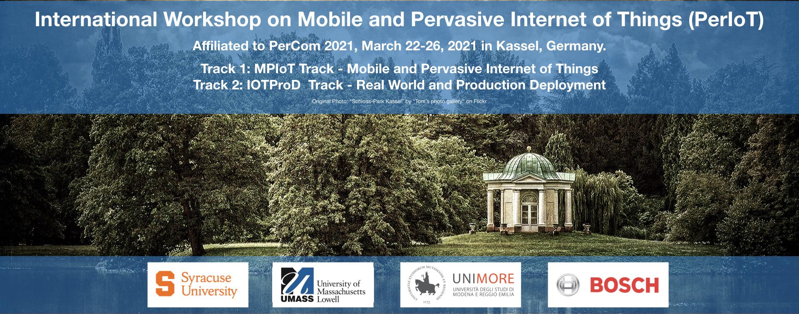

# International Workshop on Mobile and Pervasive Internet of Things (PerIoT)

##  March 26, 2021 in Kassel, Germany (co-located with  [IEEE PerCom 2021](http://www.percom.org/))

<strong>Virtual</strong>

_**In the light of the international situation of the CoVID-19 pandemic,
the PerCom General Chairs and Steering Committee have decided that [PerCom 2021 will be virtual](http://www.percom.org/) (synchronous zoom meeting).**_
**PerIoT 2021 will be virtual too**

The Internet-of-Things (IoT) rapidly revolutionized the scenario of modern technologies and communication systems. The IoT enables large numbers of previously unconnected devices to communicate and exchange data and deal with services that span areas from healthcare to transportation and much more, with the potential for significant benefits to people and quality of life. In recent years, the Internet has become increasingly pervasive allowing people to connect anytime and everywhere to achieve pervasiveness and mobility. The coupling among mobile technology, embedded objects, and a worldwide pervasive communication infrastructure constitutes the Mobile and Pervasive Internet-of-Things. However, the domain of mobile and pervasive IoT has expanded in recent years which lead to few new challenges like 1) IoT has quickly evolved to a new appified era where third-party developers can write apps for IoT platforms using programming frameworks, 2) with the advent of emerging IoT technologies like industrial IoT, agriculture IoT and narrowband IoT, new research problems are surfacing related to connectivity and data storage, and 3) the confluence of IoT with augmented and virtual reality (AR/VR), there are newer challenges to enable digital representation of physical objects.

Nevertheless, for a long time, IoT has been mainly driven by academics and only during last years companies and industrial players understood the real potential of these technologies and started guiding the fourth industrial revolution and the creation and deployments of production-ready IoT applications. This new trend uncovered a plethora of new additional appealing technological challenges (affecting all the architectural layers) associated with the design and deployment of innovative IoT technologies out of the comfort zone bringing them to the real world and to long term production environments.

The aim of the workshop is to bring together authors from the research and industrial communities, standardization bodies, and institutional entities to meet and exchange ideas on recent research, challenges and future directions on: i) the recent advances in the area of existing and emerging mobile and pervasive IoT technologies and ii) research, challenges and future directions for IoT real-world deployments in multiple production-ready application scenarios. PerIoT is organized with two main tracks in order to properly highlight the contributions related to the two main focuses of the event. The workshop solicits high-quality papers presenting original research results on the following two core areas and the associated topics:

## **Track 1: MPIoT Track - Mobile and Pervasive Internet of Things**
  - Design of new protocols for existing and emerging IoT technologies
  - Analysis of protocols for existing and emerging IoT technologies
  - System architectures of existing and emerging IoT systems
  - Interoperability of existing and emerging IoT protocols
  - Machine Learning for existing and emerging IoT applications
  - Testing, Validation, Verification of existing and emerging IoT protocols
Energy efficiency, performance and optimization in existing and emerging  - IoT systems
Vulnerability, fault-tolerance, and reliability in existing and emerging  - IoT protocols
  - Cloud back-ends and resource management for IoT applications
New connectivity methods for IoT (e.g. 5G Networks, Legacy Networks,  - Software Defined Networks for IoT, Named IoT Networking)
  - IoT application for augmented and virtual reality
  - New protocols for pairing AR/VR with existing and emerging IoT
Debugging and diagnosing problems in IoT protocols, existing and emerging   - IoT technologies
  - Societal impacts of the existing and emerging IoT applications

## **Track 2: IOTProD  Track - Real World and Production Deployment**
  - IoT Real-World Deployments
  - IoT Connectivity Standards
  - Transition from research prototype to industry grade products
  - IoT Sustainability and Energy Awareness
  - IoT Privacy
  - Edge Computing deployments and architectures
  - Edge and Cloud interoperability and integration
Digital Twin oriented approaches and cyber physical interaction   - applications
  - Emerging AI techniques and adoption on large scale datasets
  - Application and case studies of 5G and IoT
Tooling for debugging and diagnostics, monitoring and decreasing  - operational costs while increasing system availability
  - IoT root cause and predictive analysis in large networks
  - Multi-region/multi-vendor autonomic adaptation
  - IoT systems of systems (large scale, multi-region, multi-use case)
  - Mobility challenges and Edge Computing
Software Engineering and Architecture for IoT (reusability of AI models,  - pay per feature, microservices)

## Technical Program
TBD

## Important Dates

Papers submission deadline: **<strike>November 9, 2020</strike> December 16, 2020** (**HARD deadline**) 
Author notification due: **<strike>January 5, 2021</strike> January 22,
2021 (Tentative)** 
Camera ready deadline: **February 5, 2021 (FIRM)** 
Author registration deadline: **See  PERCOM  2021  website** 
Workshop date: **March 26, 2021 (Friday) (Tentative)**

## Submission Guidelines

Papers should contain research and scholarly work describing original, previously unpublished work, which is not currently under review by another workshop, conference, or journal. Submissions must be made via EDAS.

Regular papers should present novel perspectives within the scope of one of the two tracks of the workshop. Papers must be in PDF format (6 pages maximum). Papers in excess of page limits will not be considered for review or publication. PerIoT is single-blind. All papers must be typeset in double-column IEEE format using 10pt fonts on US letter paper, with all fonts embedded. The IEEE LaTeX and Microsoft Word templates, as well as related information, can be found at the IEEE Computer Society website (available here: [https://www.ieee.org/conferences/publishing/templates.html](https://www.ieee.org/conferences/publishing/templates.html))

PerIoT will be held in conjunction with IEEE PERCOM 2021. All accepted papers will be included in the PERCOM proceedings and published by the IEEE. Workshop papers will be included and indexed in the IEEE digital libraries (Xplore).

Submission link: [https://edas.info/N27743](https://edas.info/N27743)

## Registration

**Each   accepted   workshop   paper   requires   a   full   PerCom   registration   (no   registration   is   available   for  workshops  only)**;  otherwise,  the  paper  will  be  withdrawn  from  publication.  The  authors  of  all  accepted  papers  must  guarantee  that  their  paper  will  be  presented  at  the  workshop.  Papers  not  presented  at  the  workshop  will  be  considered  as  a  "**no-show**"  and  it  will  **not  be  included  in  the  proceedings**.  

## Organizers

####  **Co-Chairs**  

  - **Track 1: MPIoT track**
    - [**Farzana Rahman**](https://farahman.github.io/) 
      Syracuse University, Syracuse NY 
      Email: frahma02@syr.edu

    - [**Endadul Hoque**](https://endadul.github.io) 
      Syracuse University, Syracuse NY 
      Email: enhoque@syr.edu

    - [**Mohammad Arif Ul Alam**](http://faculty.uml.edu/~alam/) 
      University of Massachusetts Lowell, USA 
      Email: MohammadArifUl_Alam@uml.edu

  - **Track 2: IOTProD track**
    - [**Nicola Bicocchi**](http://personale.unimore.it/rubrica/dettaglio/nbicocchi) 
      Università di Modena e Reggio, Emilia, Italy 
      Email: nicola.bicocchi@unimore.it

    - [**Marco Picone**](https://www.marcopicone.net/) 
      Università di Modena e Reggio, Emilia, Italy 
      Email: marco.picone@unimore.it

    - [**Alexander Artemenko**](#) 
      Robert Bosch GmbH, Stuttgart, Germany 
      Email: Alexander.Artemenko@de.bosch.com

####  **Technical Program Committee**

  - **Track 1: MPIoT track**
    - Aliza Heching - IBM Research, NY
    - Qiyin Fang - McMaster, CA
    - Sarah Masud Preum - CMU
    - Abhishek Mukherji - Accenture
    - Carlo Vallati - University of Pisa, Italy
    - Wenyao Xu - University of Buffalo
    - Tauhidur Rahman - UMass Amherst
    - Ahmad Salman - James Madison University, USA
    - Reza Fathi - University of Houston, USA
    - Asif Salekin - Syracuse University, USA
    - Ann Ngu - Texas State University, USA
    - Baris Aksanli - San Diego State University, USA

  - **Track 2: IOTProD track**
    - Luca Veltri - University of Parma, Italy
    - Marco Mamei - University of Modena and Reggio Emilia, Italy
    - Pietro Manzoni - Universitat Politècnica de València, Spain
    - Carlo Giannelli - University of Ferrara, Italy

####  **Publicity Chair**

  - [**Samy El-Tawab**](http://educ.jmu.edu/~eltawass/) 
    James Madison University, VA, USA 
    Email: eltawass@jmu.edu

  - [**Peter Zdankin**](https://www.vs.uni-due.de/mitarbeiter_zdankin.shtml) 
    University of Duisburg-Essen, Germany 
    Email: peter.zdankin@uni-due.de

## Hotel and Venue Information

[Information](http://www.percom.org/)

## Previous workshops

- [PerIot 2020](https://periot.github.io/2020/)
- [PerIot 2019](https://periot.github.io/2019/)
- [PerIot 2018](https://periot.github.io/2018/)
- [PerIot 2017](https://periot.github.io/2017/)
